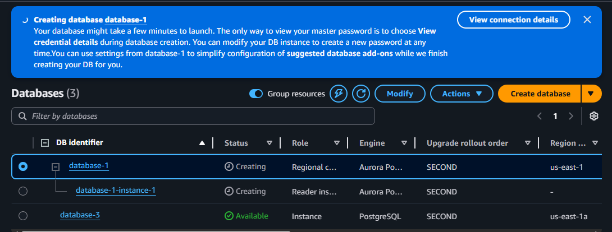

## Getting Started

To run this application locally:

```bash
npm install
npm run dev
```

---

## Building for Production

To build the application for production:

```bash
npm run build
```

---

## Setting Up Better Auth

1. Create a `.env` file and copy the contents of `.env.example` into it.

2. Generate and set the `BETTER_AUTH_SECRET` environment variable:

```bash
openssl rand -base64 32
```

Add the generated value to your `.env`.

---

## Setting Up Database (AWS RDS)

### 1. Create the Database

1. Go to the AWS Console and navigate to **RDS**.
2. Click **Create database**.

While creating the database:

* **Database creation method:** Easy Create
* **Engine options:** PostgreSQL
* Keep most settings as default.
* Under **Credentials management**:

  * Select **Self managed**
  * Enable **Auto generate password**

3. Click **Create database**.

---

### 2. Retrieve Database Credentials

After a few seconds you will see a banner similar to this:



1. Click **View credentials** and copy the generated password.
2. Open the created database.
3. Go to the **Connectivity & security** tab.
4. Wait until **Connection steps** appear (this can take a short time).

You will see connection details such as:

* Endpoint
* Port
* Username

Use these along with the copied password to construct your `DATABASE_URL` inside `.env`.

---

### 3. Make the Database Publicly Accessible

1. Open the database page in RDS.
2. Click **Modify**.
3. Under **Connectivity**, expand **Additional configuration**.
4. Enable **Publicly accessible**.
5. Save the changes.

---

### 4. Configure Security Group

1. Note the **Security Group** used by the database.
2. Navigate to:

```
EC2 → Security Groups
```

3. Select the security group used by the database.
4. Click **Edit inbound rules**.
5. Add a rule:

| Type       | Source    |
| ---------- | --------- |
| PostgreSQL | 0.0.0.0/0 |

⚠️ This allows connections from anywhere. For production, restrict it to trusted IPs.

---

### 5. Generate Auth Tables (First-Time Setup)

Run the following command in your project directory (where `.env` contains a valid database URL):

```bash
npx auth@latest generate
```

When prompted, confirm database table modifications.